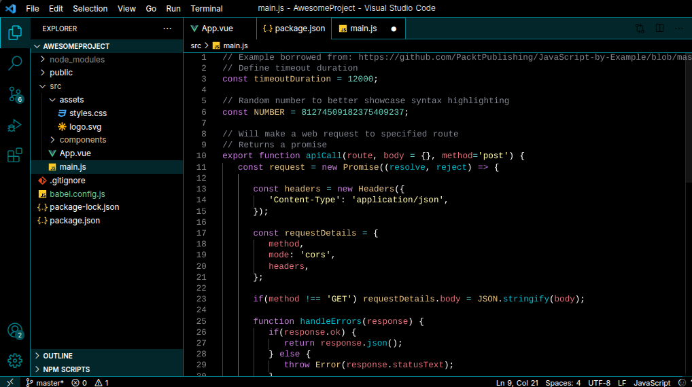

# Nicolet FEAR Dark Theme

A dark theme for Visual Studio Code.

## Installation

1. Go to the [Releases](../../releases) page of this repository
2. Download the latest `nicolet-fear-dark-0.0.1.vsix` file
3. Open VS Code
4. Press `Ctrl+Shift+P` (Windows/Linux) or `Cmd+Shift+P` (Mac)
5. Type **Extensions: Install from VSIX…** and select it
6. Navigate to your downloaded `.vsix` file and select it
7. Click **Install**

## Activation

1. Press `Ctrl+Shift+P` (Windows/Linux) or `Cmd+Shift+P` (Mac)
2. Type **Preferences: Color Theme** and select it
3. Find and select **Nicolet FEAR** from the list

## Preview

# Nicolet FEAR Dark Theme

A dark theme for Visual Studio Code.

## Installation

1. Go to the [Releases](../../releases) page of this repository
2. Download the latest `nicolet-fear-dark-0.0.1.vsix` file
3. Open VS Code
4. Press `Ctrl+Shift+P` (Windows/Linux) or `Cmd+Shift+P` (Mac)
5. Type **Extensions: Install from VSIX…** and select it
6. Navigate to your downloaded `.vsix` file and select it
7. Click **Install**

## Activation

1. Press `Ctrl+Shift+P` (Windows/Linux) or `Cmd+Shift+P` (Mac)
2. Type **Preferences: Color Theme** and select it
3. Find and select **Nicolet FEAR** from the list

## Preview

